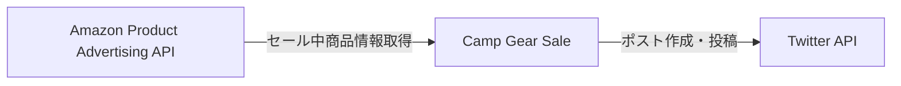

# Camp Gear Sale

## 概要

キャンプ用品のセール情報を定期的にツイートするアプリケーション。
Amazonからセール中の商品情報を取得し、その商品情報をまとめたポストを作成しXに投稿します。

## 機能

- Amazonからセール中のキャンプ用品の商品情報（商品タイトル、割引率、商品URL、ブランド名）を取得
- 取得した商品情報をフォーマットしてポストを作成
  - タイトルを三点リーダで省略
  - 商品URLをtinyurlで短縮
  - 商品タイトル中のブランド名にハッシュタグをつける
- スケジューラ（`apscheduler`）で定期的に上記処理を実行

## システム構成図



## 技術スタック

- Python 3.8
- Docker 20.10.7
- Docker Compose version v2.24.6
- Amazon Product Advertising API v5
- Twitter API v2
- APScheduler 3.6

## 環境変数

以下の環境変数を`.env`ファイルに設定してください。

```env
ACCESS_KEY=PA-APIのアクセスキー
SECRET_KEY=PA-APIのシークレットキー
ASSOCIATE_ID=AmazonアソシエイトID

CONSUMER_KEY=TwitterAPIのコンシューマーキー
CONSUMER_SECRET=TwitterAPIのコンシューマーシークレット
ACCESS_TOKEN=TwitterAPIのアクセストークン
ACCESS_TOKEN_SECRET=TwitterAPIのアクセストークンシークレット
```

## ディレクトリ構成

```tree
.
├── .env
├── .gitignore
├── Dockerfile
├── README.md
├── docker-compose.yml
├── main.py
└── src
    ├── api.py
    ├── domain/
    ├── product.py
    ├── scheduler.py
    ├── tests/
    ├── tweet.py
    └── usecase/
```

## 開発環境の構築方法

1. リポジトリをクローンする。
2. 必要な環境変数を`.env`ファイルに設定する。
3. Dockerを使用してアプリケーションをビルドする。

    ```bash
    docker-compose build
    ```

4. コンテナを起動する。

    ```bash
    docker-compose up
    ```

## 実行方法

Dockerコンテナ内で以下のコマンドを実行する。

```bash
python src/main.py
```
